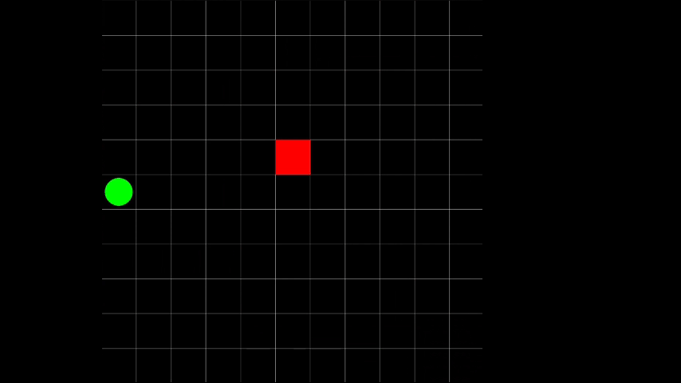
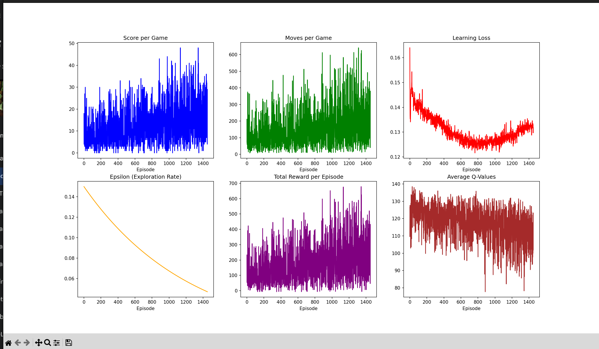

# 🐍 Neural Snake from Scratch

Built a Snake game. Then taught it to play itself with a neural network. No TensorFlow. No PyTorch. Just NumPy and math.



## The Journey

Started by creating a Snake game using Pygame, playable by humans.[GitHub Link](https://github.com/Tunar-ssp/Snake-game)
Developed a version that allows AI interaction.
Built a neural network from scratch to control the AI.
Created naural network from scrath with 17 input features. Then 35. Got ambitious and tried feeding the whole grid map as input. Bumped it to 45 features. Didn't work well. Went back to 35. That was the sweet spot.

Implemented from scratch:
- ReLU activation & backpropagation
- Q-learning with experience replay
- Gradient descent & gradient clipping
- A 3-layer fully connected network that actually learns

The AI plays by eating food and not dying. That's it.

---

## Project Structure

```
neural-snake-from-scratch/
├── main.py                          # Training loop (where everything happens)
├── run_test.py                      # Evaluate trained models
├── plot_save.py                     # Live visualization during training
│
├── neural_network/
│   ├── ai.py                        # 3-layer neural network + Q-learning
│   ├── agent.py                     # State representation (what the AI "sees")
│   └── test_models.py               # Model evaluation & metrics
│
├── snake_game/
│   ├── game.py                      # Main game loop & reward system
│   ├── snake.py                     # Snake movement & collision
│   ├── food.py                      # Food spawning & rendering
│   ├── gave_over.py                 # Game over detection
│   ├── plane.py                     # Grid rendering
│   └── settings.py                  # Game constants (grid size, etc.)
│
├── models/                          # Saved neural network weights
├── hyperparameter_test_results/     # Experiment logs
└── requirements.txt                 # Python dependencies
```

---

## How It Works

### 1. **The Neural Network** (`ai.py`)
- **Architecture**: 3-layer fully connected network
  - Input layer: 35(or 45 input or whole map with diffrent infos) neurons (game state features)
  - Hidden layer 1: 256 neurons (learns patterns)
  - Hidden layer 2: 128 neurons (refines decisions)
  - Output layer: 3 neurons (move left/straight/right)

- **Activation**: ReLU for hidden layers, linear output
- **Learning**: Q-learning with experience replay
- **Optimization**: Gradient descent with L2 regularization


### **Training Loop** (`main.py`)

```
For each game:
  1. Get current game state (35 features)
  2. Choose action:
     - With probability epsilon: random (exploration)
     - Otherwise: best action from network (exploitation)
  3. Execute action, get reward
  4. Store experience in memory
  5. Every N steps or when game ends:
     - Sample random batch from memory
     - Calculate Q-value targets
     - Update network weights via backpropagation
```

**Epsilon Decay**: Starts at 1.0 (explore randomly), decays to 0.05 (mostly exploit). This ensures the AI explores early, then trusts its learning.

### **Reward System** (`game.py`) 
I have changed these settings bilion times for getting better results (these are not good actually)
```python
game_over:        -10  (hitting wall or self = bad)
food_eaten:       +10  (eating = good)
trapped:          -10  (all 4 directions blocked)
closer_to_food:   +0.5 (moving toward food = small reward)
away_from_food:   -0.5 (moving away from food = small penalty)
```

---

## Getting Started

### Prerequisites
```bash
pip install -r requirements.txt
```

### Train the AI
```bash
python main.py
```


**Training is slow!** Because it is based on your CPU power

### Test a Model
```bash
python run_test.py
```

Select models to test, then choose how many games to run and whether to render visually.


---

## Key Hyperparameters (in `main.py`)

| Parameter | Default | What It Does |
|-----------|---------|--------------|
| `learning_rate` | 0.00005 | How big each weight update is |
| `gamma` | 0.99 | How much future rewards matter (0=immediate only, 1=future matters equally) |
| `epsilon` | 1.0 | Starting exploration rate |
| `epsilon_decay` | 0.9995 | Multiply epsilon by this each game |
| `BATCH_SIZE` | 128 | How many experiences to learn from at once |

**Pro tip**:The `hyperparameter_test_results/` folder has experimental data showing how different settings affect learning.

---

## Performance Metrics

When training, the system tracks:

- **Score**: How much food the snake ate before dying
- **Moves**: Total steps in that game
- **Loss**: How wrong the network's predictions were
- **Epsilon**: Current exploration rate (should decay over time)
- **Total Reward**: Sum of all rewards in the game
- **Q-Values**: Average predicted value of actions (should increase as learning improves)

These are plotted live in a 2×3 subplot grid.

---

## Game Rules

- **Movement**: Up, Down, Left, Right 
- **Win Condition**: There isn't one—higher scores are better
- **Lose Condition**: Hit a wall or yourself

---


##  Known Issues & Quirks

**Grid-based state representation is inefficient**: The `StateBuilder` class creates grid states, but a standard MLP doesn't understand spatial structure well. Solution: Use `WorkerAgentVision` instead (which is what `main.py` does now).



### Best Config (10k_results.json)
- **Learning Rate**: 0.0005
- **Gamma**: 0.95 (less emphasis on distant future)
- **Approach Reward**: 0.2 (small bonus for moving toward food)
- **Distance Penalty**: -0.1 (small penalty for moving away)
- **Results**: Avg Score 34.08, Max Score 67 🏆

### Key Insights
- Lower gamma (0.95 vs 0.99) learns faster
- Balanced reward shaping matters—too high and the network ignores food, too low and it doesn't learn
- Exploration decay of 0.9995 is near-optimal for this setup

